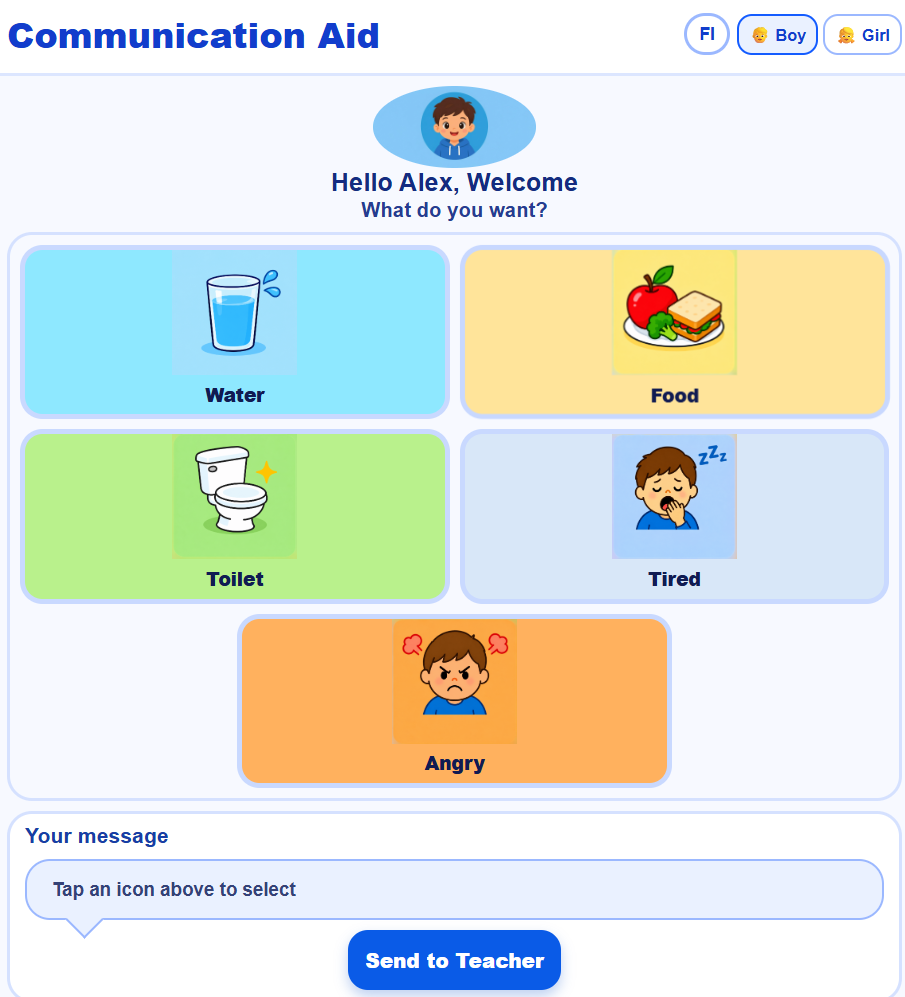
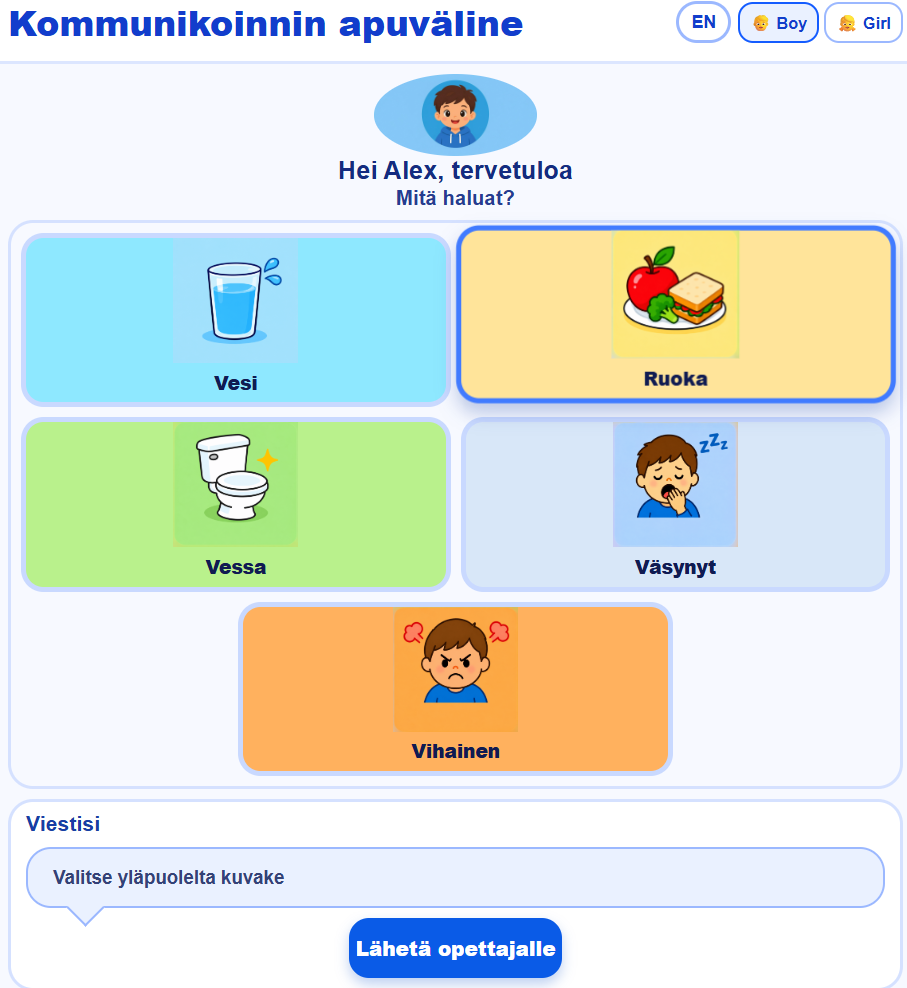

# Communication Aid App

An Electron desktop communication aid for students who benefit from selecting clear visual needs. The student can choose an icon, see the related sentence, and hear it spoken aloud.

## Version

The initial release is **1.0.0**. The planned improvements for **1.1.0** are listed in [Planned version 1.1.0](#planned-version-110).

## Features in version 1.0.0

- Visual communication tiles for Water, Food, Toilet, Tired, Angry, and Sleep.
- English and Finnish interface translations.
- Speech synthesis for the selected need.
- A visible selected-message area.
- A "Send to Teacher" button that currently shows an availability message; it does not yet send a message.
- Electron desktop application window.

## Screenshots

| English | Finnish |
| --- | --- |
|  |  |

## Run the app

### Prerequisites

- [Node.js](https://nodejs.org/)
- npm

### Installation and start

From the `comm_app` folder, install the dependencies and start Electron:

```bash
npm install
npm start
```

## How to use

1. Select **FI** or **EN** to switch between Finnish and English.
2. Select a need tile.
3. Read the selected message and listen to the spoken sentence.
4. Select **Send to Teacher** to see the current placeholder notification.

## Project structure

```text
comm_app/
├── index.html        # Application structure and communication tiles
├── style.css         # Layout, colours, tile styling, and responsive rules
├── script.js         # Translations, tile interaction, and speech synthesis
├── index.js          # Electron main process and window configuration
├── images/           # Student and communication-tile images
├── App_demo_en.png   # English screen example
├── App_demo_fi.png   # Finnish screen example
└── package.json      # Electron dependency and npm start command
```

## Planned version 1.1.0

Version 1.1.0 will improve personalisation and layout:

- Remove the app title from the header to create more space for the communication screen.
- Enable a Boy/Girl toggle button so the student version can be selected.
- Remove the face from the Water tile image.
- Improve responsive layouts, including a mobile breakpoint so the tiles and controls fit smaller screens more clearly.

## Authors

Roshan, Darshika, and Nimesha.

## Links

- [GitHub repository](https://github.com/Karelia-Software-Projetcs/communication_app)
- [Online demo](https://karelia-software-projetcs.github.io/communication_app/)
